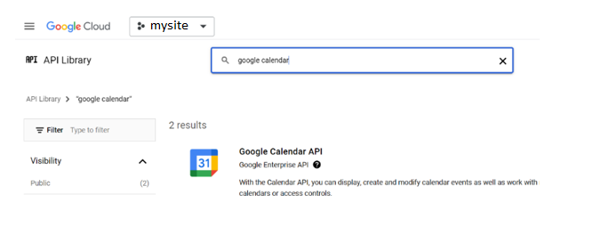
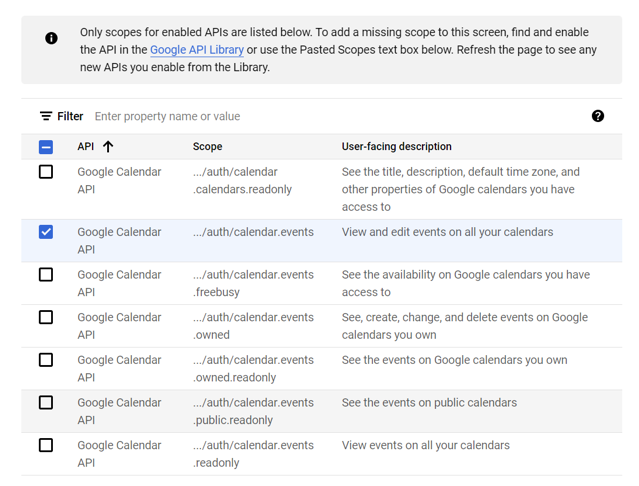
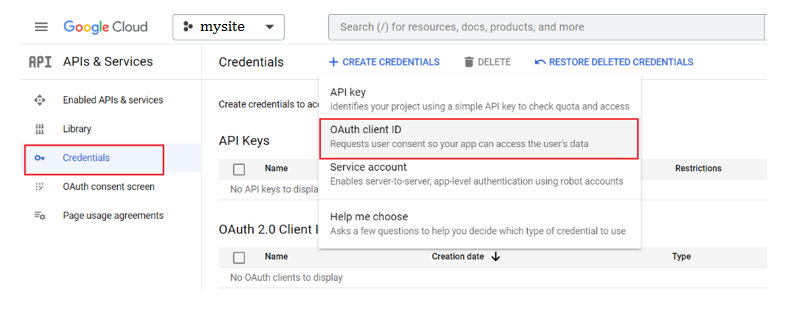
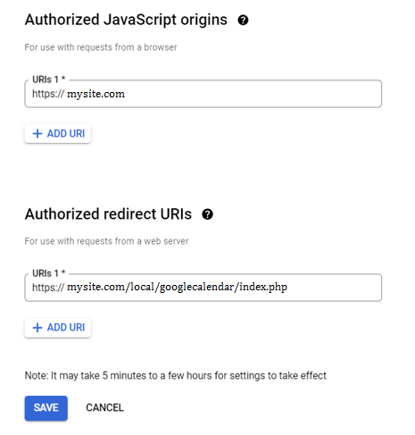
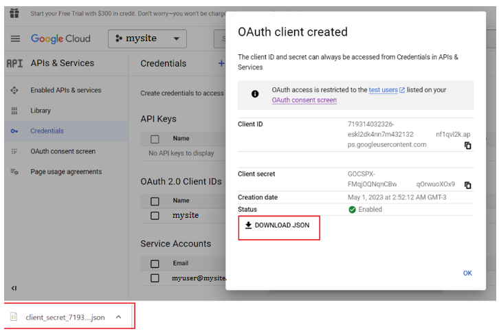

# Google Calendar Integration

## Description
This is a Moodle Local Plugin that allows integration with Google calendar

## How to generate and download the .json credentials

1. Create a google cloud project:
    [Create a Google Cloud project  |  Google Workspace  |  Google Developers](https://developers.google.com/workspace/guides/create-project)

2. Enable Google calendar API:
    [Enable Google Workspace APIs  |  Google Developers](https://developers.google.com/workspace/guides/enable-apis)

    Find and select google calendar, then click Enable:

    

3. Configure OAuth consent screen
    [Configure the OAuth consent screen  |  Google Workspace  |  Google Developers](https://developers.google.com/workspace/guides/configure-oauth-consent)

    Select External user type.
    Add the scope for Google Calendar API, scope: ../auth/calendar/events

    

    Save and Continue.
    Under Test users add the user myuser@mysite.com

4. Create access credentials
    [Create access credentials  |  Google Workspace  |  Google Developers](https://developers.google.com/workspace/guides/create-credentials)

    Among the three types of existing credentials you must choose OAuth client ID, and then follow the instructions for OAuth client ID credentials only:

    

    The fields Authorized Javascript origins and Authorized redirects URIs must be completed as:

    

    Finally download the json file and add it to this task, and then we will add it to the site:

    

## Installation
Put these files in local/googlecalendar directory and the vendor folder where you need it

## Requirements
Moodle 3.4+