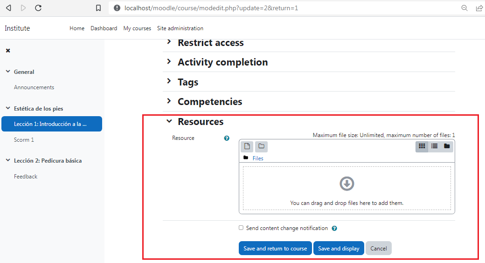
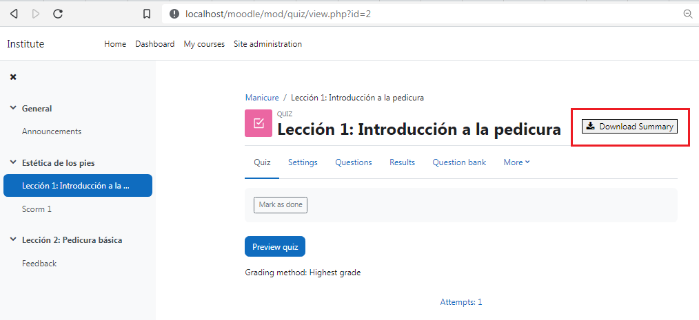
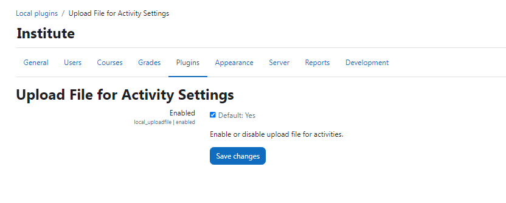

# Upload File for Activity

## Description
This is a Moodle Local Plugin that adds a setting to all course module edit forms for uploading a file to associate with that activity instance. When a file is uploaded, that activity present a link to download that file to the student.

1. All the moodle activities setting pages can add a new setting to upload a file:

    

2. When an activity has an uploaded file the activity display the following button:

    

    1. When you click the button, the uploaded resource is downloaded in a different tab
    2. The button has a configurable name

3. There is a feature flag to toggle this feature on / off at a site level:

    

## Installation
Put these files in local/uploadfile directory

## Requirements
Moodle 4.0+